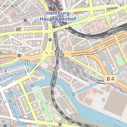

# Experimental renderer

This repo contains an experimental rudimentary OSM renderer. Its goal is to be able to render some sort of map with little operational overhead.

Experimental renderer (this will not be updated on every release, so ymmv) compared with osm.org:




Images [OpenStreetMap](https://www.openstreetmap.org/) contributors, [CC-BY-SA](https://creativecommons.org/licenses/by-sa/2.0/)

To use this, pass an oms.pbf file via `-osm_path`.

Currently osm.pbf files have to be prepared like so
```
osmium add-locations-to-ways ~/Downloads/hamburg-latest.osm.pbf -o prepared.osm.pbf
```

This creates a temporary file on startup, which might take some time.
Testing so far was only done for individual cities.

## Usage

```
Usage of go-gl-osm:
  -host string
        HTTP Listening host (default "0.0.0.0")
  -osm_path string
        Path to osm_path to use for direct rendering. (experimental)
  -port int
        HTTP Listening port (default 8080)
  -static string
        Path to static file directory (default "./static/")
  -tls_cert_path string
        Path to TLS certificate
  -tls_key_path string
        Path to TLS key
  -tls_port int
        HTTPS Listening port. This listener is only enabled if both tls cert and key are set. (default 8443)
  -verbose
        Output debug log messages
```